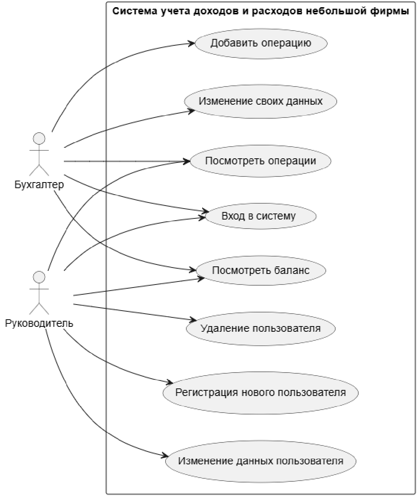

## Система «Учёт расходов/доходов небольшой фирмы»

### 1. Описание предметной области
Предметная область системы — учёт доходов и расходов небольшой фирмы. Фирма получает деньги от продажи товаров или услуг и несёт расходы на закупку товаров, оплату услуг и другие нужды. В работе фирмы возникает необходимость фиксировать финансовые операции и получать общую информацию о движении денежных средств.

В системе каждая операция рассматривается как **доход** или **расход**. Для операции необходимо указать её тип, сумму и краткое описание. На основании сохранённых операций система рассчитывает общую сумму доходов, общую сумму расходов и текущий баланс фирмы.

---

### 2. Цели и задачи
**Цель системы** — организовать учёт доходов и расходов небольшой фирмы и предоставить пользователям доступ к данным в соответствии с их правами.

**Основные задачи:**
* Вход пользователей в систему;
* Разграничение прав доступа по ролям;
* Создание, изменение и удаление учётных записей пользователей руководителем;
* Изменение своих данных бухгалтером;
* Добавление финансовой операции с указанием типа, суммы и описания;
* Просмотр списка сохранённых операций;
* Расчёт общей суммы доходов, расходов и текущего баланса.

---

### 3. Пользователи и права доступа
| Роль | Доступные действия |
| :--- | :--- |
| **Руководитель** | Просмотр операций и баланса, управление учётными записями (регистрация, изменение, удаление). |
| **Бухгалтер** | Добавление финансовых операций, просмотр операций и баланса, изменение собственных данных. |

---

### 4. UML Диаграмма прецедентов (Use Case)
Для наглядного представления функциональности системы создана диаграмма прецедентов с помощью **PlantUML**:



---

### 5. Исходный код проекта
Точка входа в программу расположена в файле `project.py`:

```python
print("Hello")
print("World")
```